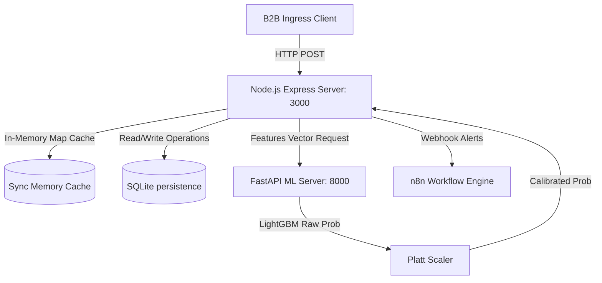

# Sentinel Platform Architecture

This document describes the high-level system architecture, data flows, and resilience engineering of the Sentinel Real-Time Fraud Incident & Abuse Intelligence Platform.

---

## 1. Multi-Process Blueprint

Sentinel uses a dual-engine architecture to separate high-throughput numerical inference from complex transaction orchestration and persistent audit logging:

---

## 2. Component Directory

### A. API Ingress Gateway (`server.ts`)
- Implemented in Node.js/TypeScript using Express.
- Mounts IP-based rate limiting (120 reqs/min window) and strict body payload limits (10MB).
- Validates field parameters against NaN, Infinity, negative values, and oversized buffers.
- Centrally handles errors, logging internal stack traces while returning request IDs to clients.

### B. SQLite Persistence & Map Synchronizer (`server/db_sqlite.ts`)
- Executes alphabetical, hash-validated schema migrations at database boot.
- Synchronizes SQLite tables to RAM using the `SqliteMap` class, supporting synchronous in-memory checks with asynchronous database writes.
- Applies indexes on primary keys, user IDs, device IDs, merchant IDs, and timestamps.

### C. ML Inference Daemon (`ml/serve.py`)
- FastAPI python process running on port 8000.
- Loads LightGBM booster model, feature schemas, and preprocess mappings on startup.
- Fast-fails initialization (returning HTTP 503) if required model artifacts are missing or corrupt.
- Implements `/health`, `/ready`, and `/metrics` telemetry interfaces.

### D. Incident Clustering Engine (`server/sentinel_service.ts`)
- Aggregates sliding window transaction telemetry.
- Evaluates Z-score volume deviations over merchant baselines to trigger fraud spikes.
- Clusters entities sharing IP addresses, device signatures, and beneficiary IDs.
- Correlates multi-entity alerts inside a 15-minute deduplication window.

---

## 3. Resilience & Failure Safety

| Failure Case | Detection Mechanism | Mitigation Action | Risk Level |
| :--- | :--- | :--- | :--- |
| **Model service offline** | API timeout or HTTP 503 | Fall back to local rules checking, route case to `REVIEW`, skip blocking. | Degraded |
| **Database offline** | SQL execution exception | Fast-fail requests with clean `DATABASE_ERROR` message, prevent data corruption. | Critical |
| **Gemini LLM offline** | Client timeout / API error | Explanations return a generic evidence summary, core scoring remains active. | Safe |
