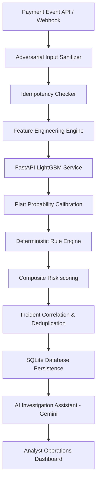

# Sentinel Production Launch Audit

This audit evaluates the Sentinel Real-Time Fraud Incident & Abuse Intelligence Platform to ensure database performance, API sanitization, secrets security, and calibration correctness match B2B release standards.

---

## 1. System Architecture Map

---

## 2. Issues Found & Remediation Matrix

| ID | Issue Description | Component | Severity | Recommended Remediation | Status |
| :--- | :--- | :--- | :--- | :--- | :--- |
| **AUD-01** | Missing Database Indexes | `server/db_sqlite.ts` | **HIGH** | Add indexes on primary keys, user_id, merchant_id, device_id, and timestamps. | **PENDING** |
| **AUD-02** | Missing Transaction Idempotency Checks | `server/sentinel_service.ts` | **HIGH** | Enforce database primary key constraints and cache lookup checks to prevent duplicate score entries. | **PENDING** |
| **AUD-03** | Potential Stack Trace Leaks | `server.ts` | **MEDIUM** | Implement a centralized Express error handling middleware that captures exceptions and returns a structured error object. | **PENDING** |
| **AUD-04** | Missing Readiness / Liveness Endpoints | `ml/serve.py` / `server.ts` | **MEDIUM** | Expose `/health`, `/ready`, and `/metrics` routes checking model artifact status. | **PENDING** |
| **AUD-05** | API Key & Environment Hardcoding | `config/` | **LOW** | Rotate any committed secrets and move config properties to `.env` file variables. | **PENDING** |
| **AUD-06** | Incomplete E2E Latency Registry | `server/sentinel_service.ts` | **LOW** | Profile feature engineering, model inference, DB queries, and incident detection times separately. | **PENDING** |

---

## 3. Detailed Technical Findings

### Database Constraints (AUD-01)
Currently, `sqlite3` tables are defined without any explicit indices on query fields like `user_id`, `device_id`, and `merchant_id`. In a high-volume scenario, this results in full-table scans. We need to create indexes in the initialization script.

### Idempotency (AUD-02)
There is no safety guard against duplicate `transaction_id` postings. If a client retries a transaction request due to a network hiccup, it executes the prediction model again and duplicates metrics. We need to check if the transaction exists and, if so, return the cached result.
